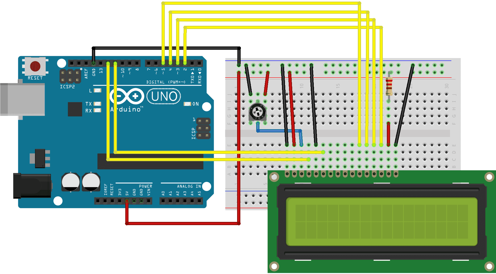

# LCD Wiring

## Pin Description

| Pin | Symbol | Function                  |
|-----|--------|---------------------------|
| 1   | VSS    | Ground                    |
| 2   | VDD    | +5V Power Supply          |
| 3   | V0     | Contrast Adjustment (Vo)  |
| 4   | RS     | Register Select           |
| 5   | R/W    | Read/Write Mode (Tie to GND for Write Only) |
| 6   | E      | Enable Signal             |
| 7   | D0     | Data Bit 0 (Not used in 4-bit mode) |
| 8   | D1     | Data Bit 1 (Not used in 4-bit mode) |
| 9   | D2     | Data Bit 2 (Not used in 4-bit mode) |
| 10  | D3     | Data Bit 3 (Not used in 4-bit mode) |
| 11  | D4     | Data Bit 4                |
| 12  | D5     | Data Bit 5                |
| 13  | D6     | Data Bit 6                |
| 14  | D7     | Data Bit 7                |
| 15  | A      | Backlight Anode (+)       |
| 16  | K      | Backlight Cathode (−)     |

## Wiring Instructions

- Connect **VSS** to Ground.
- Connect **VDD** to +5V power supply.
- Connect **V0** to the middle pin of a 10kΩ potentiometer for contrast adjustment.
- Connect **RS** to Arduino digital pin 12.
- Connect **E** (Enable) to Arduino digital pin 11.
- Tie **R/W** to Ground (for write mode).
- Connect **D4** to Arduino digital pin 5.
- Connect **D5** to Arduino digital pin 4.
- Connect **D6** to Arduino digital pin 3.
- Connect **D7** to Arduino digital pin 2.
- Connect **A** through a 220Ω resistor to +5V (backlight anode).
- Connect **K** to Ground (backlight cathode).

**Note:** Pins D0–D3 are unused in 4-bit mode and can be left unconnected or grounded.

